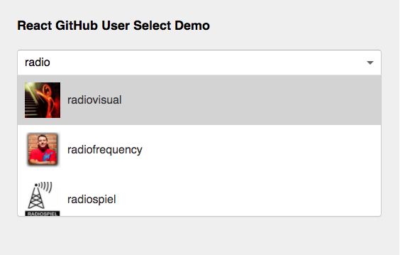

# react-github-user-select-demo

> A GitHub user search field demo in React

Just a quick demo of an auto-complete field in [React](https://github.com/facebook/react) using custom HTML option fields in [React-Select](https://github.com/JedWatson/react-select).

:smile: [Live Demo](http://radiovisual.github.io/react-github-user-select-demo)

## Usage

Type any GitHub username in the input field to search for GitHub Users. You can interact with the field using the mouse and keyboard.
 Clicking (or pressing <kbd>Enter</kbd>) will launch the user's GitHub profile.

## Features

- [x] Auto-complete search
- [x] Keyboard Interactions with Up/Down Arrow Keys
- [x] Launch User's GitHub Profile on <kbd>Enter</kbd>
- [x] Launch User's GitHub Profile on Select (click)
- [x] Active User is highlighted
- [x] Clear the search
- [x] Input placeholder
- [x] Custom HTML Input Options

**Note:** This demo does not use a GitHub API access token, so you might find some occasional throttling in the [live demo](http://radiovisual.github.io/react-github-user-select-demo).

## License

MIT